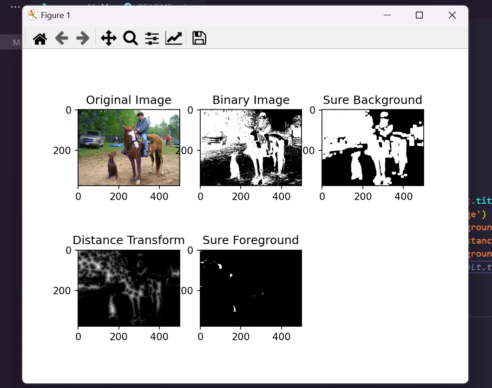

Simple implementation of image segmentation using the Watershed algorithm

Image segmentation is a process of partitioning an image into multiple segments or regions, typically to simplify the representation of an image or to make it more meaningful and easier to analyze. There are various techniques for image segmentation, including thresholding, clustering, and deep learning-based methods. 

